Distributed-Disk-Registery (gRPC + TCP)
=======================================

---


# Dağıtık Disk Kayıt Sistemi (gRPC + TCP, Hata Toleranslı)

Bu proje, Sistem Programlama dersi kapsamında dört kişilik ekibimiz (**Rasha Muhammed Ali**, **Abdullah Fawzi Saad AL RAYYIS**, **elharis halef elhammedi** ve **Habib Sultani**) tarafından geliştirilen, gRPC + TCP tabanlı, hata toleranslı dağıtık bir mesaj/abonelik sistemi şablonudur. Lider düğüm TCP üzerinden gelen SET/GET komutlarını alır, gRPC ile replika düğümlere dağıtır, mesajları diske yazar ve tolerans değerine göre üyeler arası yükü dengeler; üyeler dinamik olarak ağa katılıp ayrılabilir ve crash senaryolarında dahi mesajları ayakta kalan kopyalardan geri okuyabilir.

## 📁 Proje Yapısı

```
distributed-disk-register/
│
├── LICENSE
├── PROJE_AKISI.md
├── README.md
├── TO-DOs.md
├── pom.xml
├── tolerance.conf
├── images/
├── messages/
├── src
│   └── main
│       ├── java/com/example/family/
│       │       ├── FamilyServiceImpl.java
│       │       ├── NodeMain.java
│       │       ├── NodeRegistry.java
│       │       ├── StorageServiceImpl.java
│       │       ├── ToleranceConfig.java
│       │       └── commands/
│       │               ├── Command.java
│       │               ├── CommandParser.java
│       │               ├── GetCommand.java
│       │               ├── InvalidCommand.java
│       │               └── SetCommand.java
│       └── proto/
│               └── family.proto
└── target/                  (derleme çıktıları)

```

## 🚀 Çalıştırma (IDE ve CLI hızlı başlangıç)

- VS Code (Java Extension Pack): repo’yu aç, terminalden komutları çalıştır.
- IntelliJ IDEA: `pom.xml` ile aç, Maven import sonrası Run/Debug config olarak `com.example.family.NodeMain` seçip çalıştır; ek terminallerde aynı komutla üyeleri başlat.

Adımlar:
1) Derle: `mvn clean compile`
2) Lideri başlat: `mvn exec:java -Dexec.mainClass=com.example.family.NodeMain` (port 5555, TCP 6666 dinler)
3) Başka terminallerde aynı komutla üyeleri başlat (5556, 5557… otomatik seçilir)
4) İstemci olarak `telnet 127.0.0.1 6666` veya `nc 127.0.0.1 6666` ile bağlanıp komut gönder:
   - `SET <id> <mesaj>`
   - `GET <id>`

## Bu projeyi şu adımlarla geliştirdik🎉:

## 1. Aşama – TCP SET / GET (Bitti ✅)

* [x] Grup üyeleri girişini yap.
* [x] GitHub’daki şablon repoyu **fork** et.
* [x] GitHub’da ekip için proje oluştur, task’ları tanımla ve üyelere ata.
* [x] TCP server için SET / GET komutlarını parse eden yapı geliştir.

### Görev Dağılımı

* **Habib**
  * [x] Command abstraction tasarımı  
    (`Command`, `SetCommand`, `GetCommand`)

* **Abdullah**
  * [x] `CommandParser` implementasyonu  
    (SET / GET protokolü)

* **Haris**
  * [x] `CommandParser`’ın TCP server’a entegrasyonu

* **Rasha**
  * [x] TCP SET / GET testleri
  * [x] Aşama 1 dokümantasyonu

### Test Kanıtları

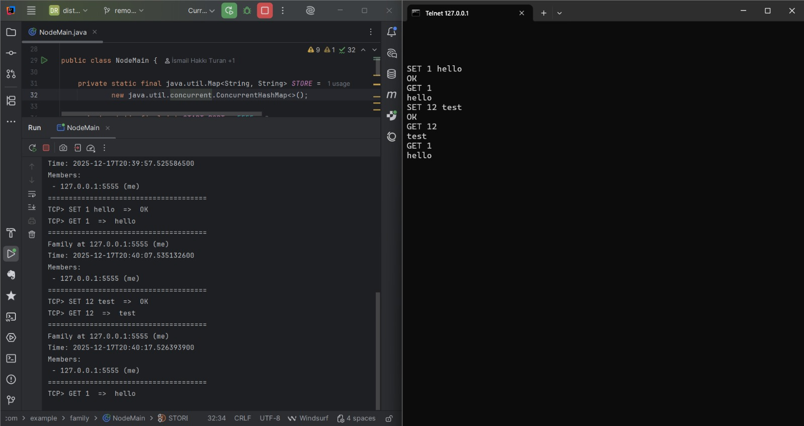


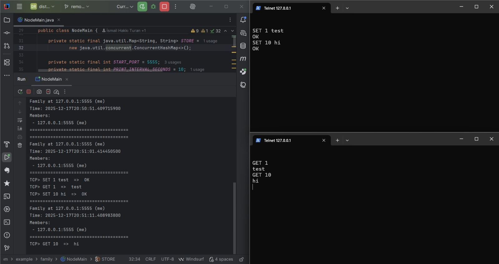

---

## 2. Aşama – Diskte Mesaj Saklama (Bitti ✅)

**Amaç:** Disk IO, buffered/unbuffered fikrine giriş.

* [x] `messages/` klasöründe her mesajı **ayrı dosyada** tut
* [x] `SET <id> <msg>`: Diskte dosya oluştur / üzerine yaz
* [x] `GET <id>`: İlgili dosyayı aç, içeriği oku, istemciye dön
* [x] İki farklı IO modu araştırılabilir:

  * [x] **Buffered IO** ile yaz/oku (örn. `BufferedWriter`, `BufferedReader`)
  * [x] **Unbuffered IO** (doğrudan `FileOutputStream`, `FileInputStream`)


  * Buffered vs unbuffered farkı nedir, hangi durumda daha avantajlıdır?

  * 2.Aşamada zaman kaybetmemek için tipik dosyaya yazma işlemi ile bitirip, daha sonra buraya dönebilirsiniz.

### Görev Dağılımı

* **Haris**
  * [x] SET komutu için disk yazma (write) mantığının uygulanması

* **Habib**
  * [x] GET komutu için disk okuma (read) mantığının uygulanması

* **Abdullah**
  * [x] Buffered ve unbuffered disk IO yaklaşımlarının araştırılması

* **Rasha**
  * [x] Disk IO entegrasyonu ve Aşama 2 dokümantasyonunun hazırlanması

### Buffered vs Unbuffered Temel Farkları

**Unbuffered (buffersız) I/O**, veriyi kaynaktan doğrudan okur veya hedefe doğrudan yazar.  
Her `read` veya `write` çağrısı işletim sistemine gider. Bu nedenle çok sayıda küçük
okuma/yazma işlemi yapıldığında performans düşer.  
`FileInputStream` ve `FileReader` gibi sınıflar buffersız çalışır.

**Avantajlar**
- Yapısı basittir, anlaması kolaydır  
- Ek buffer belleği kullanmaz  
- Az sayıda I/O işlemi için yeterlidir  

**Dezavantajlar**
- Performansı düşüktür  
- Her okuma/yazmada işletim sistemine gider  
- Büyük dosyalarda ve sık I/O’da yavaş çalışır


**Buffered (tamponlu) I/O** ise veriyi önce bellekte bir **buffer** içine alır.
Program veriyi bu bellek alanından okur veya bu alana yazar; buffer dolunca ya da
boşalınca işletim sistemiyle iletişime geçilir. Bu yaklaşım, I/O çağrılarını azalttığı
için daha hızlıdır.  
`BufferedInputStream` ve `BufferedReader` bu yapıya örnektir.

**Avantajlar**
- Daha hızlıdır  
- İşletim sistemi çağrıları azalır  
- Büyük dosyalar ve sık I/O işlemleri için idealdir  

**Dezavantajlar**
- Bir miktar ekstra bellek kullanır  
- Yapısı biraz daha karmaşıktır  
- Gerekli durumlarda `flush()` çağrısı gerekebilir  

### Test Kanıtları

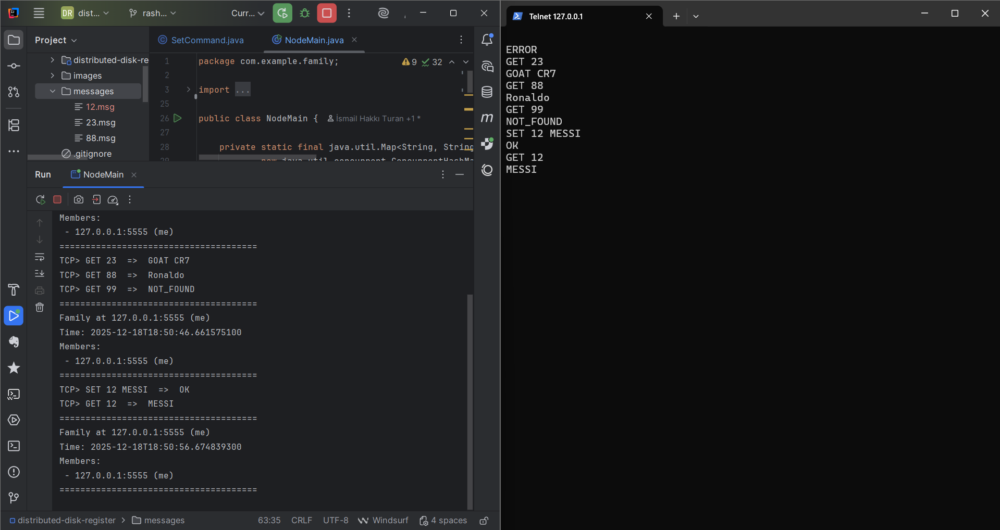

#### Loglar

```client outputs
G
ERROR
GET 23
GOAT CR7
GET 88
Ronaldo
GET 99
NOT_FOUND
SET 12 MESSI
OK
GET 12
MESSI
```

```terminal outputs
Node started on 127.0.0.1:5555
Leader listening for text on TCP 127.0.0.1:6666
New TCP client connected: /127.0.0.1:52061
TCP> G  =>  ERROR
======================================
Family at 127.0.0.1:5555 (me)
Time: 2025-12-18T18:50:36.743612700
Members:
 - 127.0.0.1:5555 (me)
======================================
TCP> GET 23  =>  GOAT CR7
TCP> GET 88  =>  Ronaldo
TCP> GET 99  =>  NOT_FOUND
======================================
Family at 127.0.0.1:5555 (me)
Time: 2025-12-18T18:50:46.661575100
Members:
 - 127.0.0.1:5555 (me)
======================================
TCP> SET 12 MESSI  =>  OK
TCP> GET 12  =>  MESSI
======================================
Family at 127.0.0.1:5555 (me)
Time: 2025-12-18T18:50:56.674839300
Members:
 - 127.0.0.1:5555 (me)
======================================
======================================
Family at 127.0.0.1:5555 (me)
Time: 2025-12-18T18:51:06.671870700
Members:
 - 127.0.0.1:5555 (me)
======================================
```

---

## 3. Aşama – gRPC Mesaj Modeli (Bitti ✅)

**Amaç:**

* [x] `.proto` dosyasında StoredMessage tanımı eklenmeli.
* [x] Java tarafında mesaj temsilini Protobuf (StoredMessage, MessageId, StoreResult) ile kullanılmalı.
* [x] gRPC servis iskeleti oluşturuldu: StorageService { Store(StoredMessage) returns (StoreResult); Retrieve(MessageId) returns (StoredMessage) }.
* [x] Henüz dağıtık replika yok; amaç gRPC fonksiyonunu ayağa kaldırmak.

### Görev Dağılımı

* **Abdullah**
  * [x] Storage protobuf mesajları (StoredMessage, MessageId, StoreResult)

* **Rasha**
  * [x] StorageService gRPC arayüzü (Store, Retrieve RPC)

* **Habib**
  * [x] StorageService server iskeleti (StorageServiceImpl, disk-backed)

* **Haris**
  * [x] gRPC storage testi ve dokümantasyon (Stage 3)

### Kod/Proto Durumu

* `family.proto`: StoredMessage, MessageId, StoreResult + StorageService { Store, Retrieve } (tek node için)
* `StorageServiceImpl`: `Store` RPC dosyaya (`messages/<id>.msg`) ve in-memory store'a yazar, `Retrieve` RPC dosyadan okur/yoksa NOT_FOUND.
* `NodeMain`: gRPC server'a StorageService ekli (FamilyService ile birlikte).

### Testler (tek node, grpcurl)

* Store:
  ```bash
  grpcurl -plaintext -proto src/main/proto/family.proto \
    -d '{"id":42,"text":"hello from curl"}' 127.0.0.1:5556 family.StorageService/Store
  ```
  Beklenen: `{"ok":true}` ve `messages/42.msg` oluşur.

* Retrieve:
  ```bash
  grpcurl -plaintext -proto src/main/proto/family.proto \
    -d '{"id":42}' 127.0.0.1:5556 family.StorageService/Retrieve
  ```
  Beklenen: `{"id":42,"text":"hello from curl"}`.

* NOT_FOUND:
  ```bash
  grpcurl -plaintext -proto src/main/proto/family.proto \
    -d '{"id":9999}' 127.0.0.1:5556 family.StorageService/Retrieve
  ```
  Beklenen: gRPC `NOT_FOUND`.

### Notlar

* Bu aşamada dağıtık replika yok; tolerans/replication Stage 4+ için beklemede.

---

## 4. Aşama – Tolerance=1 ve 2 için Dağıtık Kayıt (Bitti ✅)

**Amaç:** Hata toleransı 1 ve 2 için **temel dağıtık kayıt sistemi**.

* [x] `tolerance.conf` dosyasını okuyun:

  * İçinde tek satır olsun: `TOLERANCE=2`
* [x] Lider, her SET isteğinde:

  1. Gelen id+mesajı diske kaydetsin (kendi mesaj haritasına da eklesin)
  2. Üye listesinden tolerance sayısı kadar üye seçsin:

     * Tolerance=1 → 1 üye
     * Tolerance=2 → 2 üye
  3. Bu üyelere gRPC ile `Store(StoredMessage)` RPC’si göndersin
  4. Hepsinden başarılı yanıt geldiyse istemciye `OK`
  5. Bir veya daha fazlası başarısız olursa:

     * Bu durumda ne yapılacağı (retry, ERROR, vb) takım tasarımına bırakılabilir
* [x] Lider, “mesaj id → hangi üyelerde var” bilgisini bir map’te tutsun:

  * `Map<Integer, List<MemberId>>`
* [x] GET isteğinde:

  * Eğer liderin kendi diskinde varsa doğrudan kendinden okusun
  * Yoksa mesajın tutulduğu üye listesinden sırayla gRPC ile `Retrieve` isteği göndersin
  * İlk cevap veren (ya da hayatta kalan) üyeden mesajı alıp istemciye döndürsün

### Görev Dağılımı

* **Habib**
  * [x] tolerance.conf okuyucusunu kodla.

* **Haris**
  * [x] 1 ve 2 tolerans seviyeleri için replika seçimini gerçekleştir.

* **Abdullah**
  * [x] Lider (leader) düğüm üzerinde mesaj-üye eşleşmesini takip et.

* **Rasha**
  * [x] Dağıtık GET mantığını gerçekleştir.

### Testler ve Test Kanıtları

#### Test Senaryosu 1
* TOLERANCE=2
* başarılı SET + mapping + GET diskten
* SET 200 hello yap -> GET 200 yap
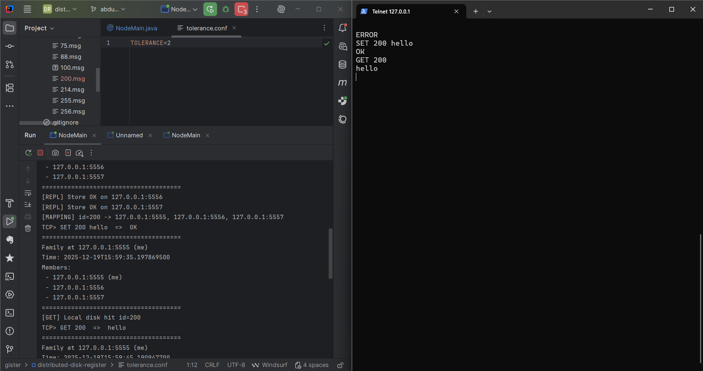

##### Loglar

```client outputs
SET 200 hello
OK
GET 200
hello
```

```terminal outputs
Node started on 127.0.0.1:5555
Configured tolerance level: 2
Leader listening for text on TCP 127.0.0.1:6666
======================================
Family at 127.0.0.1:5555 (me)
Time: 2025-12-19T15:59:05.195287600
Members:
 - 127.0.0.1:5555 (me)
 - 127.0.0.1:5556
======================================
New TCP client connected: /127.0.0.1:58061
======================================
Family at 127.0.0.1:5555 (me)
Time: 2025-12-19T15:59:15.195148400
Members:
 - 127.0.0.1:5555 (me)
 - 127.0.0.1:5556
 - 127.0.0.1:5557
======================================
======================================
Family at 127.0.0.1:5555 (me)
Time: 2025-12-19T15:59:25.195331
Members:
 - 127.0.0.1:5555 (me)
 - 127.0.0.1:5556
 - 127.0.0.1:5557
======================================
[REPL] Store OK on 127.0.0.1:5556
[REPL] Store OK on 127.0.0.1:5557
[MAPPING] id=200 -> 127.0.0.1:5555, 127.0.0.1:5556, 127.0.0.1:5557
TCP> SET 200 hello  =>  OK
======================================
Family at 127.0.0.1:5555 (me)
Time: 2025-12-19T15:59:35.197869500
Members:
 - 127.0.0.1:5555 (me)
 - 127.0.0.1:5556
 - 127.0.0.1:5557
======================================
[GET] Local disk hit id=200
TCP> GET 200  =>  hello
```

#### Test Senaryosu 2
* TOLERANCE=2
* leader’da yok -> üyeden Retrieve ile getir
* SET 200 hello yap -> GET 200 yap -> 200.msg sil -> GET 200 yap
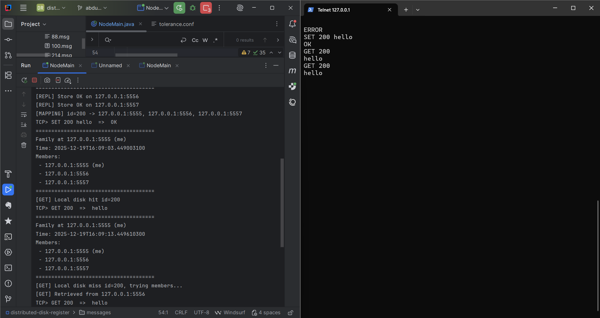

##### Loglar

```client outputs
SET 200 hello
OK
GET 200
hello
GET 200
hello
```

```terminal outputs
Node started on 127.0.0.1:5555
Configured tolerance level: 2
Leader listening for text on TCP 127.0.0.1:6666
======================================
Family at 127.0.0.1:5555 (me)
Time: 2025-12-19T16:08:43.455836500
Members:
 - 127.0.0.1:5555 (me)
 - 127.0.0.1:5556
======================================
New TCP client connected: /127.0.0.1:52084
======================================
Family at 127.0.0.1:5555 (me)
Time: 2025-12-19T16:08:53.460467300
Members:
 - 127.0.0.1:5555 (me)
 - 127.0.0.1:5556
 - 127.0.0.1:5557
======================================
[REPL] Store OK on 127.0.0.1:5556
[REPL] Store OK on 127.0.0.1:5557
[MAPPING] id=200 -> 127.0.0.1:5555, 127.0.0.1:5556, 127.0.0.1:5557
TCP> SET 200 hello  =>  OK
======================================
Family at 127.0.0.1:5555 (me)
Time: 2025-12-19T16:09:03.449003100
Members:
 - 127.0.0.1:5555 (me)
 - 127.0.0.1:5556
 - 127.0.0.1:5557
======================================
[GET] Local disk hit id=200
TCP> GET 200  =>  hello
======================================
Family at 127.0.0.1:5555 (me)
Time: 2025-12-19T16:09:13.449610300
Members:
 - 127.0.0.1:5555 (me)
 - 127.0.0.1:5556
 - 127.0.0.1:5557
======================================
[GET] Local disk miss id=200, trying members...
[GET] Retrieved from 127.0.0.1:5556
TCP> GET 200  =>  hello
```

#### Test Senaryosu 3
* TOLERANCE=2
* 1 üye down olsa bile GET çalışıyor
* SET 200 hello yap -> 200.msg sil -> Üyelerden birini kapat -> GET 200 yap
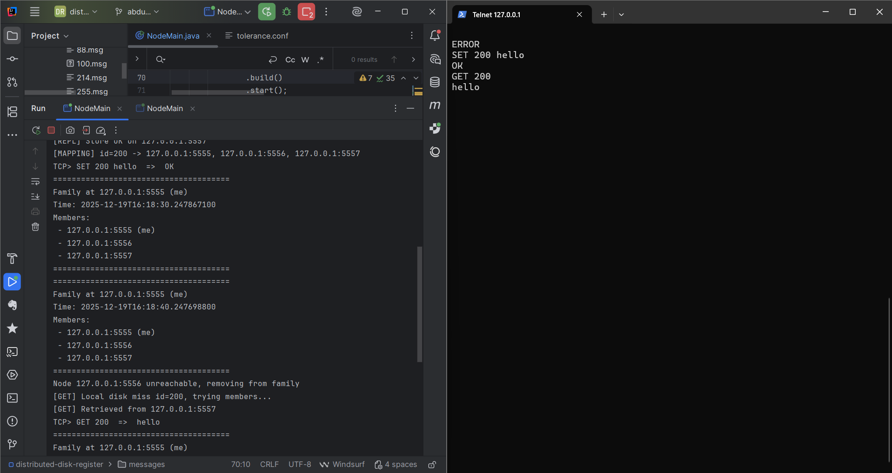

##### Loglar

```client outputs
SET 200 hello
OK
GET 200
hello
```

```terminal outputs
Node started on 127.0.0.1:5555
Configured tolerance level: 2
Leader listening for text on TCP 127.0.0.1:6666
======================================
Family at 127.0.0.1:5555 (me)
Time: 2025-12-19T16:18:10.262213800
Members:
 - 127.0.0.1:5555 (me)
 - 127.0.0.1:5556
======================================
New TCP client connected: /127.0.0.1:50749
======================================
Family at 127.0.0.1:5555 (me)
Time: 2025-12-19T16:18:20.254065100
Members:
 - 127.0.0.1:5555 (me)
 - 127.0.0.1:5556
 - 127.0.0.1:5557
======================================
[REPL] Store OK on 127.0.0.1:5556
[REPL] Store OK on 127.0.0.1:5557
[MAPPING] id=200 -> 127.0.0.1:5555, 127.0.0.1:5556, 127.0.0.1:5557
TCP> SET 200 hello  =>  OK
======================================
Family at 127.0.0.1:5555 (me)
Time: 2025-12-19T16:18:30.247867100
Members:
 - 127.0.0.1:5555 (me)
 - 127.0.0.1:5556
 - 127.0.0.1:5557
======================================
Node 127.0.0.1:5556 unreachable, removing from family
[GET] Local disk miss id=200, trying members...
[GET] Retrieved from 127.0.0.1:5557
TCP> GET 200  =>  hello
======================================
Family at 127.0.0.1:5555 (me)
Time: 2025-12-19T16:18:50.247708400
Members:
 - 127.0.0.1:5555 (me)
 - 127.0.0.1:5557
```

#### Test Senaryosu 4
* TOLERANCE=2
* SET fail path -> ERROR
* Üyelerden birini kapat -> SET 200 hello yap
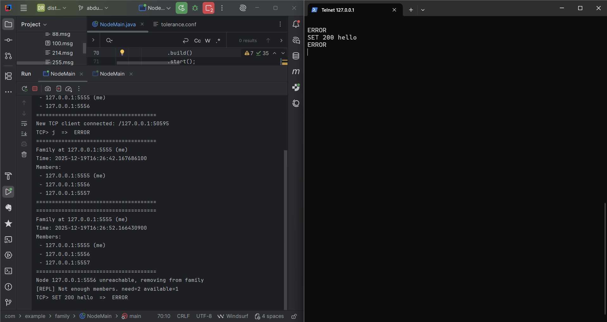

##### Loglar

```client outputs
SET 200 hello
ERROR
```

```terminal outputs
Node started on 127.0.0.1:5555
Configured tolerance level: 2
Leader listening for text on TCP 127.0.0.1:6666
======================================
Family at 127.0.0.1:5555 (me)
Time: 2025-12-19T16:26:32.174110300
Members:
 - 127.0.0.1:5555 (me)
 - 127.0.0.1:5556
======================================
New TCP client connected: /127.0.0.1:50595
======================================
Family at 127.0.0.1:5555 (me)
Time: 2025-12-19T16:26:42.167686100
Members:
 - 127.0.0.1:5555 (me)
 - 127.0.0.1:5556
 - 127.0.0.1:5557
======================================
Node 127.0.0.1:5556 unreachable, removing from family
[REPL] Not enough members. need=2 available=1
TCP> SET 200 hello  =>  ERROR
======================================
Family at 127.0.0.1:5555 (me)
Time: 2025-12-19T16:27:02.169732
Members:
 - 127.0.0.1:5555 (me)
 - 127.0.0.1:5557
======================================
```

#### Test Senaryosu 5
* TOLERANCE=1
* 1 üyeye yazıyor
* Leader + 2 üye çalıştır -> SET 200 hello yap
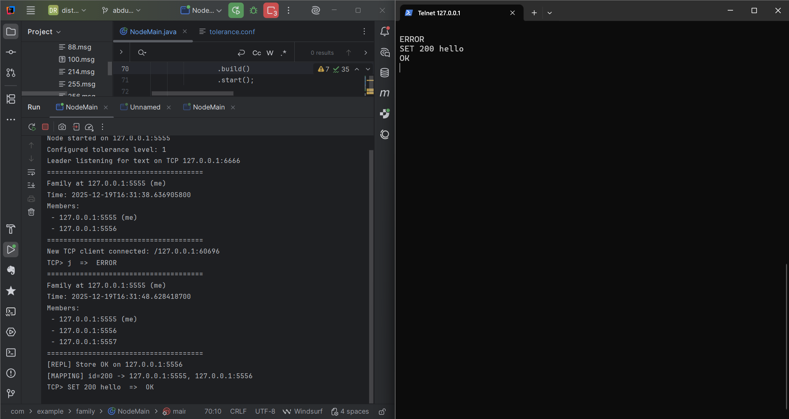

##### Loglar

```client outputs
SET 200 hello
OK
```

```terminal outputs
Node started on 127.0.0.1:5555
Configured tolerance level: 1
Leader listening for text on TCP 127.0.0.1:6666
======================================
Family at 127.0.0.1:5555 (me)
Time: 2025-12-19T16:31:38.636905800
Members:
 - 127.0.0.1:5555 (me)
 - 127.0.0.1:5556
======================================
New TCP client connected: /127.0.0.1:60696
======================================
Family at 127.0.0.1:5555 (me)
Time: 2025-12-19T16:31:48.628418700
Members:
 - 127.0.0.1:5555 (me)
 - 127.0.0.1:5556
 - 127.0.0.1:5557
======================================
[REPL] Store OK on 127.0.0.1:5556
[MAPPING] id=200 -> 127.0.0.1:5555, 127.0.0.1:5556
TCP> SET 200 hello  =>  OK
```

---

## 5. Aşama – Hata Toleransı n (Genel Hâl) ve Load Balancing (Bitti ✅)

**Amaç:** Tolerance=1,2,3,…,7 için genel çözüm + dengeli dağılım.

* [x] `tolerance.conf` içindeki değeri **yapılandırılabilir** hale getirin (1..7)
* [x] Test senaryoları:

  * Tolerance=2, 5 üye → her mesaj 2 üyeye gitsin
  * Tolerance=3, 7 üye → her mesaj 3 üyeye gitsin
* [x] Mesaj dağılımı:

  * `message_id` veya **round-robin** ile üyeleri seçebilirsiniz
  * Amaç: Çok sayıda SET sonrası üyeler arası yük mümkün olduğunca dengeli olsun
  * Bunu ölçmek için:

    * [x] Sonda her üyenin kaç mesaj sakladığını ekrana yazdıran fonksiyon ekleyin
* [x] Test dokümantasyonu:

  * 1000 SET sonrası 2 set üye için 500-500 civarı mesaj dağılımı
  * 9000 SET sonrası iki üçlü grup için 4500-4500 civarı dağılım

 ### Görev Dağılımı

* **Rasha**
  * [x] Generalize tolerance handling (1..7).

* **Abdullah**
  * [x] Implement load-balanced replica selection.

* **Habib**
  * [x] Track per-member message count.

* **Haris**
  * [x] Test load balancing and document results.


### Test Senaryoları ve Kanıtları

#### Test Senaryosu 1
* TOLERANCE=2
* Görüldüğü gibi 5 üye varken mesaj (lider hariç) sadece 2 üyeye gider.
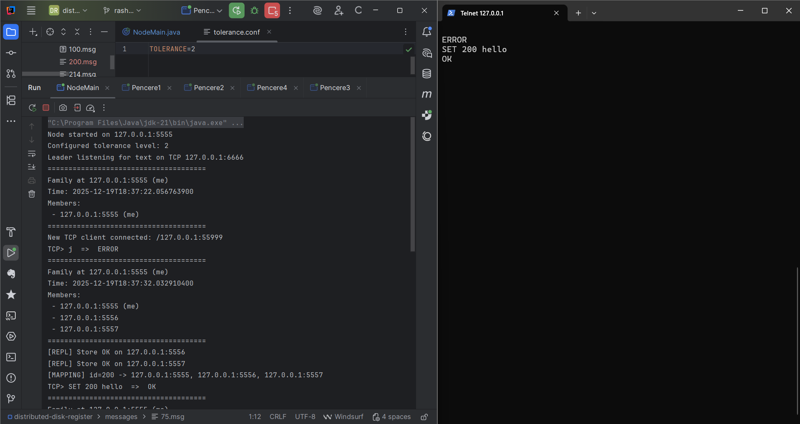

#### Test Senaryosu 2
* TOLERANCE=3
* Görüldüğü gibi 7 üye varken mesaj (lider hariç) sadece 3 üyeye gider.
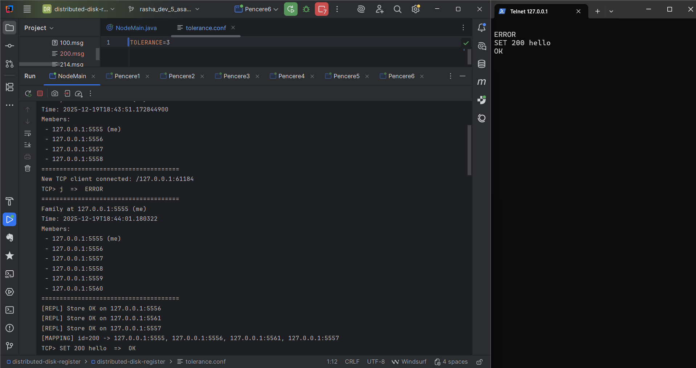

#### Test Senaryosu 3
* TOLERANCE=99
* Görüldüğü gibi tolerans sayısı (1..7) arasında olması gerekir.
  Bu Aralık dışında bir değer verilirse tolerans normalize edilir.
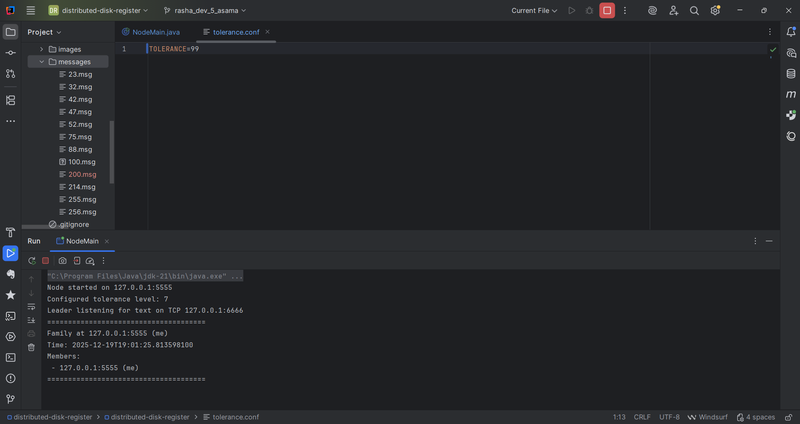

#### Test Senaryosu 4
* TOLERANCE=2
* Çok sayıda SET sonrası üyeler arası yük mümkün olduğunca dengeli olsun
* 1000 SET icin
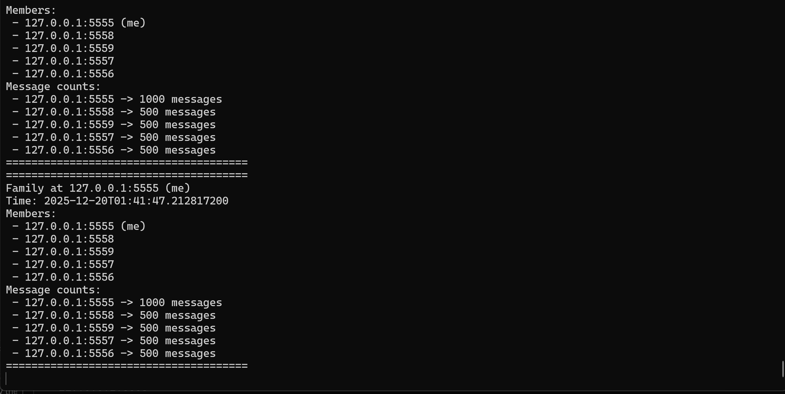

#### Test Senaryosu 5
* TOLERANCE=3
* Çok sayıda SET sonrası üyeler arası yük mümkün olduğunca dengeli olsun
* 1000 SET icin
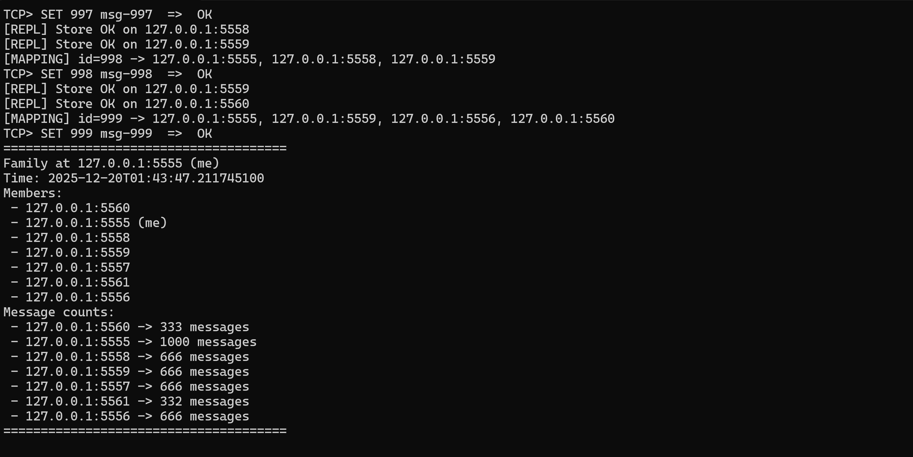

---

## 6. Aşama  – Crash Senaryoları ve Recovery (Bitti ✅)

**Amaç:** Test senaryosu 1 & 2’de tarif edilen crash durumlarını simüle etmek.

* [x] Üye proceslerinden birini manuel kapatın (kill, terminal kapama)
* [x] Lider:

  * GET sırasında crash olmuş üyeye bağlanmaya çalışırken exception aldığında:

    * O üyeyi “dead” işaretlesin (veya listeden çıkarsın)
    * Listedeki diğer üye(ler)den mesajı okumayı denesin
* [x] Test 1:

  * Tolerance=2, 4 üye
  * Mesaj id 500 → üye 3 ve 4’te kayıtlı olsun
  * Üye 3’ü kapat → lider GET 500 isteğini üye 4’ten çekebiliyor mu?
* [x] Test 2:

  * Tolerance=3, 6 üye
  * Mesaj id 4501 → üye 3,5,6’da
  * 1 veya 2 üye crash olsa bile, hayatta kalan son üyeden GET yapılabiliyor mu?

### Görev Dağılımı

* **Habib**
  * [x] Handle crashed members during gRPC calls.

* **Haris**
  * [x] Implement retry and failover for GET.

* **Abdullah**
  * [x] Mark dead members and update metadata.

* **Rasha**
  * [x] Simulate crashes and document recovery tests.


### Test Senaryoları ve Kanıtları

#### Test Senaryosu 1
* TOLERANCE=1
* SET sonrası replikasyon olmuş, bir üye (5557) düştüğünde sağlık kontrolü onu aileden ve eşlemelerden çıkarmış, GET isteği liderdeki kopyadan başarıyla dönmüş.
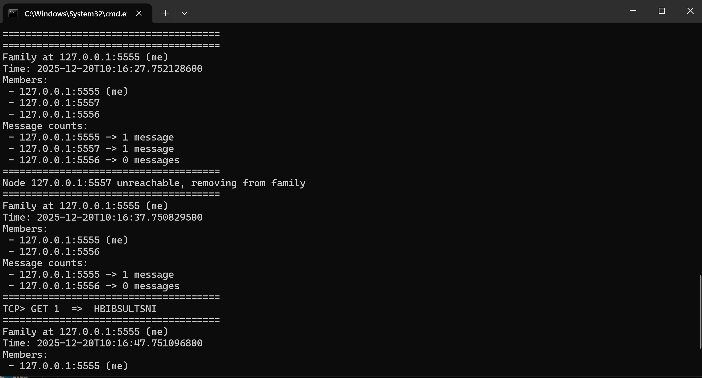

#### Test Senaryosu 2
* TOLERANCE=2
* failover çalışıyor: 5557 düştükten sonra lider (5555) yine GET 87 için değeri döndürmüş.
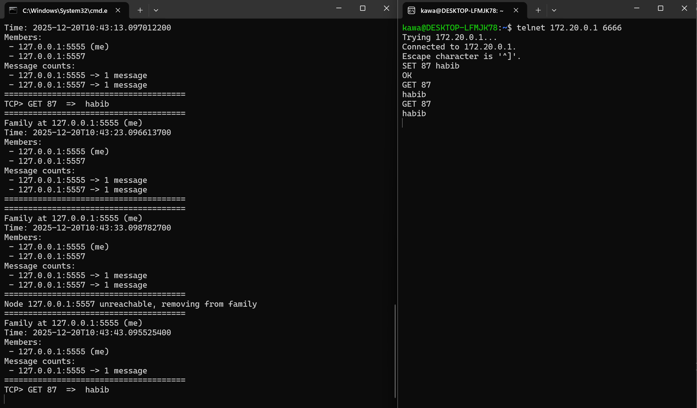

#### Test Senaryosu 3
* TOLERANCE=2
* 4 üye aç
* SET 500 test yap -> 500.msg sil -> Diğer iki üyede hala tutulmaktadır.
  * GET 500 -> Diğer iki üyenin birinden çeker.
  * Üyelerden (fotodaki pencerelerden) birini kapat -> GET 500 yap -> Hayatta kalan üyeden çeker.
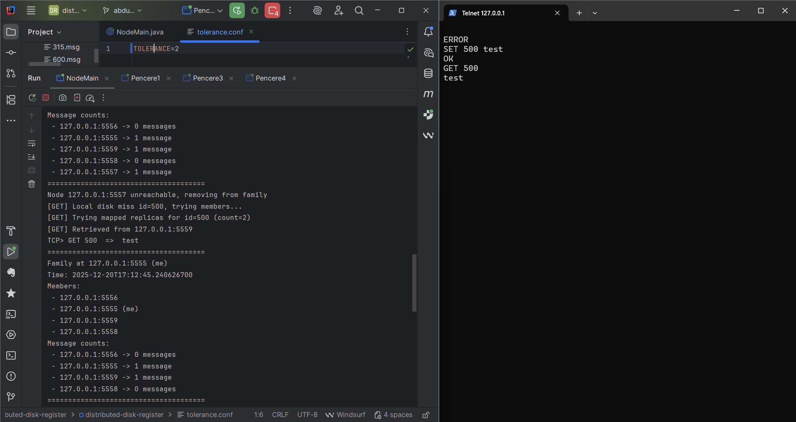

##### Loglar

```client outputs
SET 500 test
OK
GET 500
test
```

```terminal outputs
Node started on 127.0.0.1:5555
Configured tolerance level: 2
Leader listening for text on TCP 127.0.0.1:6666
======================================
Family at 127.0.0.1:5555 (me)
Time: 2025-12-20T17:11:55.246957500
Members:
 - 127.0.0.1:5555 (me)
======================================
New TCP client connected: /127.0.0.1:52575
======================================
Family at 127.0.0.1:5555 (me)
Time: 2025-12-20T17:12:05.237101900
Members:
 - 127.0.0.1:5556
 - 127.0.0.1:5555 (me)
 - 127.0.0.1:5559
 - 127.0.0.1:5558
 - 127.0.0.1:5557
======================================
[REPL] Store OK on 127.0.0.1:5557
[REPL] Store OK on 127.0.0.1:5559
[MAPPING] id=500 -> 127.0.0.1:5555, 127.0.0.1:5557, 127.0.0.1:5559
TCP> SET 500 test  =>  OK
======================================
Family at 127.0.0.1:5555 (me)
Time: 2025-12-20T17:12:35.235191300
Members:
 - 127.0.0.1:5556
 - 127.0.0.1:5555 (me)
 - 127.0.0.1:5559
 - 127.0.0.1:5558
 - 127.0.0.1:5557
Message counts:
 - 127.0.0.1:5556 -> 0 messages
 - 127.0.0.1:5555 -> 1 message
 - 127.0.0.1:5559 -> 1 message
 - 127.0.0.1:5558 -> 0 messages
 - 127.0.0.1:5557 -> 1 message
======================================
Node 127.0.0.1:5557 unreachable, removing from family
[GET] Local disk miss id=500, trying members...
[GET] Trying mapped replicas for id=500 (count=2)
[GET] Retrieved from 127.0.0.1:5559
TCP> GET 500  =>  test
======================================
Family at 127.0.0.1:5555 (me)
Time: 2025-12-20T17:12:45.240626700
Members:
 - 127.0.0.1:5556
 - 127.0.0.1:5555 (me)
 - 127.0.0.1:5559
 - 127.0.0.1:5558
Message counts:
 - 127.0.0.1:5556 -> 0 messages
 - 127.0.0.1:5555 -> 1 message
 - 127.0.0.1:5559 -> 1 message
 - 127.0.0.1:5558 -> 0 messages
======================================
```

#### Test Senaryosu 4
* TOLERANCE=3
* 6 üye aç
* SET 4501 test yap -> 4501.msg sil -> Diğer üç üyede hala tutulmaktadır.
  * GET 4501 -> Diğer üç üyenin birinden çeker.
  * Üyelerden (fotodaki pencerelerden) birini / ikisini kapat -> GET 4501 yap -> Hayatta kalan üyeden çeker.
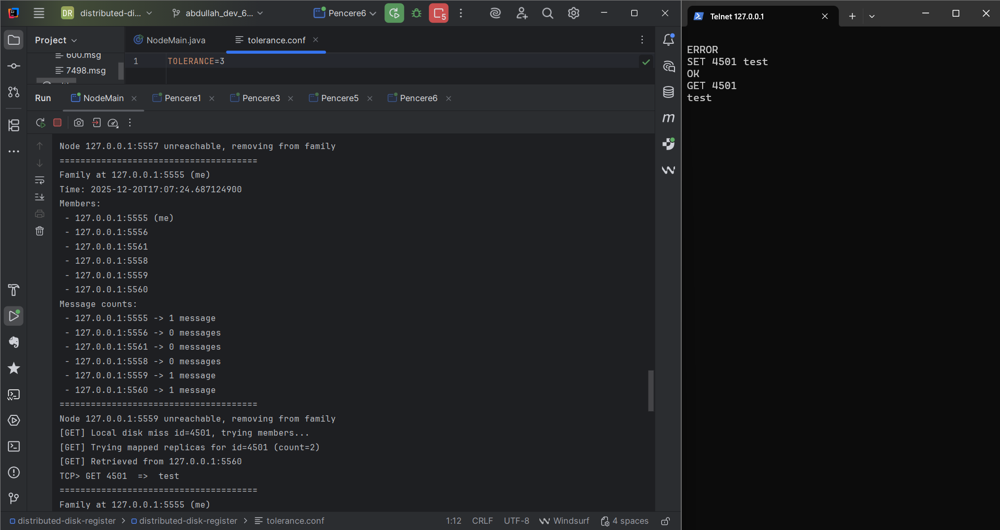

##### Loglar

```client outputs
SET 4501 test
OK
GET 4501
test
```

```terminal outputs
Node started on 127.0.0.1:5555
Configured tolerance level: 3
Leader listening for text on TCP 127.0.0.1:6666
======================================
Family at 127.0.0.1:5555 (me)
Time: 2025-12-20T17:06:04.686077300
Members:
 - 127.0.0.1:5555 (me)
 - 127.0.0.1:5556
======================================
======================================
Family at 127.0.0.1:5555 (me)
Time: 2025-12-20T17:06:14.684199900
Members:
 - 127.0.0.1:5555 (me)
 - 127.0.0.1:5556
 - 127.0.0.1:5557
 - 127.0.0.1:5558
 - 127.0.0.1:5559
 - 127.0.0.1:5560
======================================
New TCP client connected: /127.0.0.1:54921
[REPL] Store OK on 127.0.0.1:5557
[REPL] Store OK on 127.0.0.1:5560
[REPL] Store OK on 127.0.0.1:5559
[MAPPING] id=4501 -> 127.0.0.1:5555, 127.0.0.1:5557, 127.0.0.1:5560, 127.0.0.1:5559
TCP> SET 4501 test  =>  OK
======================================
Family at 127.0.0.1:5555 (me)
Time: 2025-12-20T17:06:24.696553
Members:
 - 127.0.0.1:5555 (me)
 - 127.0.0.1:5556
 - 127.0.0.1:5561
 - 127.0.0.1:5557
 - 127.0.0.1:5558
 - 127.0.0.1:5559
 - 127.0.0.1:5560
Message counts:
 - 127.0.0.1:5555 -> 1 message
 - 127.0.0.1:5556 -> 0 messages
 - 127.0.0.1:5561 -> 0 messages
 - 127.0.0.1:5557 -> 1 message
 - 127.0.0.1:5558 -> 0 messages
 - 127.0.0.1:5559 -> 1 message
 - 127.0.0.1:5560 -> 1 message
======================================
Node 127.0.0.1:5557 unreachable, removing from family
Node 127.0.0.1:5559 unreachable, removing from family
[GET] Local disk miss id=4501, trying members...
[GET] Trying mapped replicas for id=4501 (count=2)
[GET] Retrieved from 127.0.0.1:5560
TCP> GET 4501  =>  test
======================================
Family at 127.0.0.1:5555 (me)
Time: 2025-12-20T17:07:34.681708600
Members:
 - 127.0.0.1:5555 (me)
 - 127.0.0.1:5556
 - 127.0.0.1:5561
 - 127.0.0.1:5558
 - 127.0.0.1:5560
Message counts:
 - 127.0.0.1:5555 -> 1 message
 - 127.0.0.1:5556 -> 0 messages
 - 127.0.0.1:5561 -> 0 messages
 - 127.0.0.1:5558 -> 0 messages
 - 127.0.0.1:5560 -> 1 message
======================================
```

---

## Proje Hakkında Önemli Notlar

### Threading Review

Bu projede aynı anda birden fazla istemci ve üye node ile iletişim kurulduğu için, işlemlerin birbirini bloklamaması adına threading yaklaşımı kullanıldı. Leader tarafında TCP üzerinden gelen her yeni client bağlantısı ayrı bir thread üzerinde ele alınıyor; böylece bir istemcinin uzun süren SET/GET isteği diğer istemcileri bekletmiyor. gRPC tarafında ise server zaten concurrent istekleri destekliyor; ek olarak periyodik işler (ör. family çıktısını yazdırma ve health-check) ScheduledExecutorService ile ayrı bir zamanlayıcı thread’inde çalıştırılıyor. Bu sayede hem sürekli çalışan arka plan kontrolleri ana iş akışını yavaşlatmıyor, hem de crash/failover senaryolarında sistem tepki verebilir kalıyor.

### IO Optimization

Disk IO tarafında amaç, mesajların kalıcı olarak saklanmasını sağlarken gereksiz okuma/yazma maliyetlerini azaltmaktı. Bunun için GET sırasında önce leader’ın local disk’inde mesajın olup olmadığı kontrol ediliyor; local’de bulunursa doğrudan diskten okunuyor (local hit). Local’de yoksa (local miss) replication/mapping bilgisi kullanılarak üyelerden okunuyor ve gereksiz tekrar denemelerden kaçınılıyor. Dosya işlemlerinde try-with-resources yaklaşımıyla kaynaklar doğru kapatılıyor, metin okuma/yazmada UTF-8 kullanılarak tutarlı çıktı elde ediliyor. Ayrıca sistemin “mapping + failover” mantığı sayesinde, tek bir node’un diskine bağımlı kalınmıyor; bu hem performansı hem de fault-tolerance davranışını güçlendiriyor.

### Code Cleanup & Refactor

Code Cleanup & Refactor aşamasında hedef, mevcut kodu daha okunabilir, sürdürülebilir ve hataya dayanıklı hale getirmek: gereksiz tekrarları azaltmak, ortak işlevleri yardımcı metotlara ayırmak, hata ve istisna yönetimini tutarlı hale getirmek, adlandırmaları netleştirmek, sihirli sayıları/strings’leri sabitlere çekmek ve konfigürasyonu merkezi hale getirmek; aynı zamanda log çıktılarını standardize edip önemli yolları testlerle güvence altına almak. Bu sayede hem yeni özellik eklemek kolaylaşır hem de olası crash/failover senaryolarında sistemin davranışı daha öngörülebilir olur.

### Final README & Submission Prep

Final README & Submission Prep aşamasında amaç, repo’yu teslim edilebilir hâle getirmek: güncel durumu, kurulum/çalıştırma adımlarını, konfigürasyon (örn. tolerance.conf), çoklu node başlatma ve örnek SET/GET akışlarını README’ye açık ve adım adım eklemek; bilinen kısıtlar ve test talimatlarını (tolerance=1/2/3 senaryoları, crash testleri) belirtmek; lisans, ekip bilgisi ve versiyon notlarını tamamlamak; gereksiz dosyaları temizleyip .gitignore’u doğrulamak; son bir derleme/test turu yapıp artefaktları repo’ya eklemeden temizlemektir. Böylece değerlendirici, projeyi hızla kurup test edebilir ve teslim paketi tutarlı olur.


## 🤝 Katkı

- Forkla ve yeni bir branch aç.
- Kod stilini ve mevcut paket yapısını koru; gereksiz artefakt ekleme.
- Değişiklikleri kapsayan kısa test/örnek akış paylaş (komutlar veya log çıktısı yeterli).
- Anlamlı commit mesajlarıyla PR aç; neyi neden değiştirdiğini özetle.

